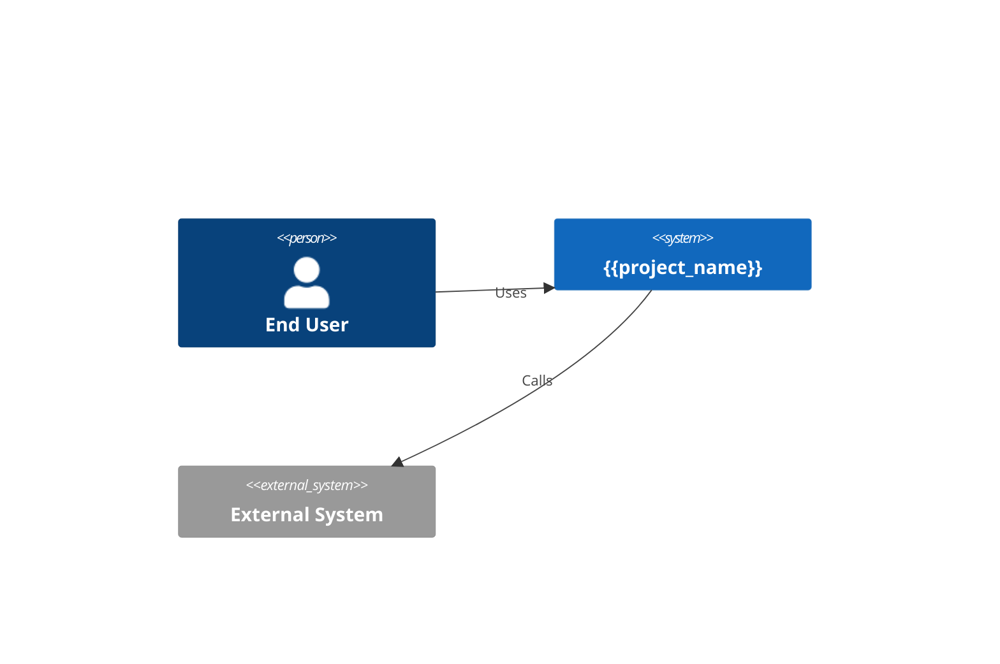
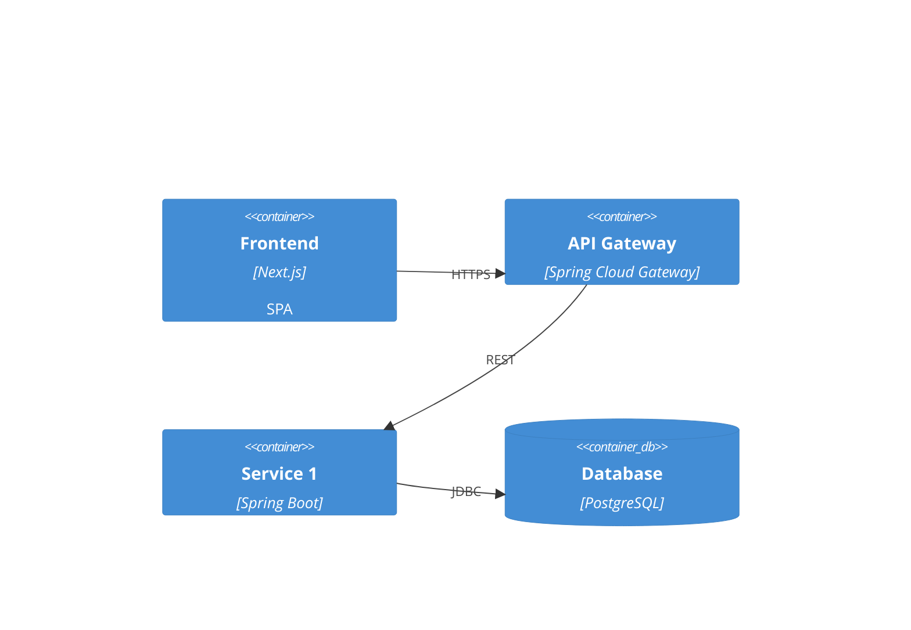
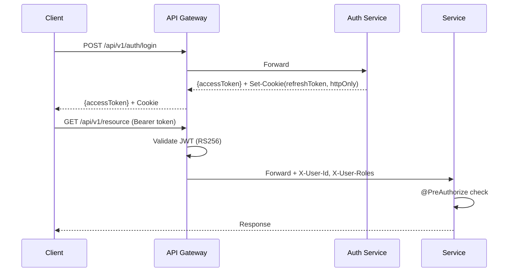
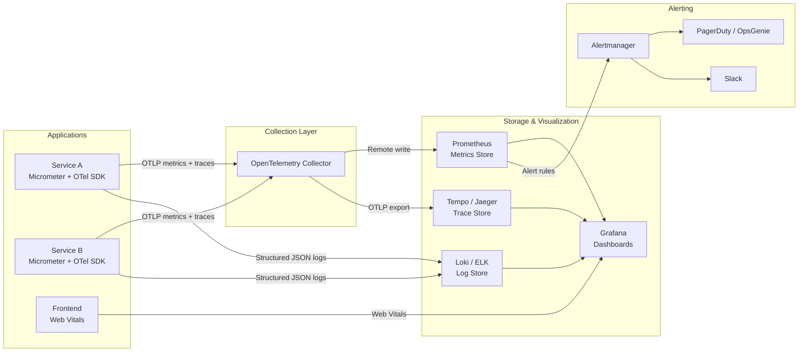

# High-Level Design (HLD) — {{project_name}}

## 1. Architecture Style Decision

**Chosen**: Monolith / Microservices / Modular Monolith
**Rationale**: Based on NFR-xxx, NFR-xxx
**ADR**: ADR-001-{style}.md

## 2. System Context (C4 Level 1)



## 3. Container Diagram (C4 Level 2)



## 4. Communication Patterns

| Pattern | Technology | Use Case |
|---------|-----------|----------|
| Sync REST | Spring RestClient | Service-to-service queries |
| Async Event | — | — (nếu dùng) |

## 5. Data Architecture

### Data Ownership Matrix
| Table | Owner Service | Read by |
|-------|-------------|---------|
| | | |

### Database Strategy
- [ ] Shared DB (simple, start here)
- [ ] DB per service (khi scale)

## 6. Security Architecture

> Chi tiết đầy đủ: [`docs/SECURITY/security-architecture.md`](../SECURITY/security-architecture.md)

### Authentication Flow



| Parameter | Value |
|-----------|-------|
| Access token TTL | 15 min (RS256) |
| Refresh token TTL | 7 days (httpOnly cookie) |
| Password hashing | bcrypt (cost ≥ 12) |
| Account lockout | 5 failures → 15 min lock |

### Authorization Model

- **Strategy**: RBAC (Role-Based Access Control) + deny-by-default
- **Roles**: `ANONYMOUS`, `USER`, `ADMIN`, `SERVICE`
- **Enforcement**: `@PreAuthorize` on ALL endpoints — no endpoint without authorization
- → Full RBAC matrix: [`security-architecture.md` §3](../SECURITY/security-architecture.md)

### Encryption

| Layer | Standard |
|-------|---------|
| In transit | TLS 1.3 (client → gateway), TLS 1.2+ (internal) |
| At rest | Database TDE + application-level AES-256-GCM for PII |
| Secrets | Vault / AWS Secrets Manager → K8s Secrets → env vars |

### API Rate Limiting

| Tier | Limit |
|------|-------|
| Anonymous | 20 req/min per IP |
| Authenticated | 100 req/min per user |
| Auth endpoints | 5 req/min per IP (brute-force protection) |

### Frontend Security

- CORS: Explicit allowed origins only (no `*` in production)
- CSP: `default-src 'self'` + nonce-based inline scripts
- Security headers: `X-Frame-Options`, `X-Content-Type-Options`, HSTS
- → Chi tiết: [`docs/SECURITY/frontend-security.md`](../SECURITY/frontend-security.md)

### Audit & Compliance

- All state-changing operations logged via `@Audited` annotation
- PII handling per GDPR: masking in logs, right to delete
- → Chi tiết: [`operations/audit-logging.md`](../../operations/audit-logging.md)

## 7. Infrastructure

- Container: Docker + Docker Compose (dev), K8s (staging/prod)
- CI/CD: {{tool}}

### Observability Architecture



| Pillar | Technology | Purpose |
|--------|-----------|---------|
| **Metrics** | Micrometer → Prometheus | RED metrics, JVM, business KPIs |
| **Tracing** | Micrometer Tracing + OTel → Tempo/Jaeger | Distributed request tracing |
| **Logging** | Logback (structured JSON) → Loki/ELK | Centralized log aggregation |
| **Alerting** | Prometheus Alertmanager → PagerDuty/Slack | Incident notification |
| **Dashboards** | Grafana | Unified visualization |

→ Chi tiết: [`operations/monitoring-spec.md`](../../operations/monitoring-spec.md)
→ Alert policy: [`operations/alerting-escalation.md`](../../operations/alerting-escalation.md)

## 8. Architecture Decision Records

Tối thiểu 3 ADR bắt buộc. Thêm ADR-004+ nếu dự án có quyết định kiến trúc đáng kể khác.

| ADR | Decision | Status |
|-----|---------|--------|
| ADR-001 | Service Decomposition | Accepted |
| ADR-002 | API Conventions | Accepted |
| ADR-003 | Event Taxonomy | Accepted |
| ADR-004 | {{additional decision}} | Accepted |

> Mỗi ADR = 1 file riêng trong `docs/architecture/ADRs/`

## 9. Hard Boundaries

→ Xem `agent_docs/hard-boundaries.md` (extracted từ đây)

## 10. Fitness Functions (ArchUnit)

```java
@ArchTest
static ArchRule no_cross_service_imports = noClasses()
    .that().resideInAPackage("..service1..")
    .should().dependOnClassesThat().resideInAPackage("..service2..");
```
