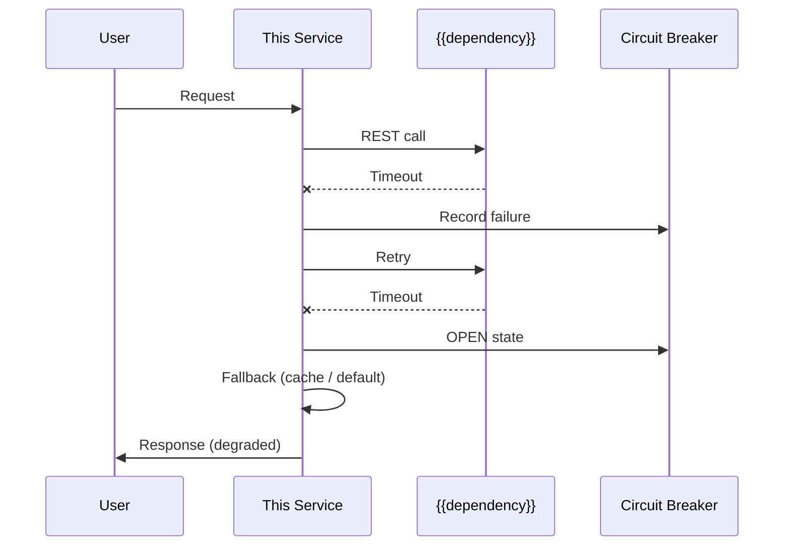

# {{name}}-service — Low-Level Design (LLD)

> **Context budget**: ~230 dòng per service. Load khi cần hiểu thiết kế chi tiết của 1 service.

<!--
HARD RULES (xem SPEC-BOUNDARIES.md):

  1. Tech-design mô tả **service-level design quyết định** — pattern, boundary,
     transaction model, error taxonomy, retry/cache/scale policy.
  2. KHÔNG paste compile-ready code. Entity / Client / DTO mô tả bằng BẢNG
     (`field | type | constraint | note`) hoặc contract shape, KHÔNG Java class.
  3. Snippet được phép ≤10 dòng, CHỈ khi minh hoạ pattern khó (e.g. saga step,
     mermaid flow). Gắn nhãn "illustrative, not source of truth".
  4. Full SQL (CREATE TABLE/INDEX/ALTER) thuộc migration-spec. Ở đây chỉ
     reference migration spec hoặc mô tả index strategy bằng bảng.
  5. Feature-specific flow thuộc impl-spec. Ở đây là cross-feature pattern.
-->


## 1. Service Boundary

| Attribute | Value |
|-----------|-------|
| **Port** | {{port}} |
| **Base package** | `com.{{company}}.{{project}}.{{service}}` |
| **Tables owned** | {{table1}}, {{table2}} |
| **Calls →** | {{other-service}} via REST |
| **Called by ←** | {{caller-service}} |
| **Auth requirement** | User JWT (public API) / API Key (internal) |
| **Security ref** | [`security-architecture.md`](../../docs/SECURITY/security-architecture.md) |

## 2. Internal Architecture

```
api/               → Controllers, DTOs, Mappers
domain/            → Entities, Repositories, Services (business logic)
integration/       → REST Clients to other services
common/            → Exception handlers, Response wrappers
config/            → Spring configuration
```

## 3. Domain Model

> Mô tả **shape** và **invariant** của aggregate. KHÔNG class skeleton.
> Nếu shape đã có ở `contracts/*.yaml` (DTO) hoặc migration-spec (table),
> CHỈ reference, không lặp lại.

### Aggregate: {{AggregateName}}

| Field | Type | Constraint | Note |
|---|---|---|---|
| `id` | UUID | PK, generated | — |
| `{{field}}` | {{type}} | {{NOT NULL / UNIQUE / CHECK}} | {{business meaning}} |
| `createdAt` | Instant | NOT NULL | Immutable |
| `updatedAt` | Instant | nullable | Set on update |

**Related aggregates**: {{list các aggregate có foreign relation + cardinality}}
**Table mapping**: `{{table_name}}` — full schema xem `migrations/V{{NNN}}__{{description}}.md`

### Enums / Value Objects

| Name | Values / Shape | Used by |
|---|---|---|
| `{{Status}}` | `DRAFT`, `SUBMITTED`, `PROCESSED`, `COMPLETED`, `REJECTED` | `{{AggregateName}}.status` |

### State Machine (nếu có)

```
DRAFT → SUBMITTED → PROCESSED → COMPLETED
                  → REJECTED
```

**Transition rules**: {{điều kiện cho từng chuyển trạng thái — 1 câu/rule}}

### Invariants (always true)

- INV-1: {{e.g. "amount > 0 khi status != DRAFT"}}
- INV-2: {{e.g. "không thể REJECTED sau khi đã COMPLETED"}}
- INV-3: {{e.g. "version tăng monotonic"}}

### Aggregate boundary

- **Được thay đổi trong cùng transaction**: {{list}}
- **Chỉ eventual-consistent**: {{list — thay đổi qua event/saga}}

## 4. REST Clients (outbound integrations)

> Chỉ mô tả **decision + contract shape** cho từng client. Cài đặt
> (`@CircuitBreaker`, `@Retry`, body, mapper) nằm ở source code.

### Client: {{Target}}ServiceClient

| Aspect | Value |
|---|---|
| Target service | {{target}}-service |
| Endpoint used | `GET /internal/{{resource}}/{id}` |
| Protocol | REST / gRPC / messaging |
| Timeout | {{2000ms}} |
| Retry policy | {{2 times, 500ms backoff, only on IO/5xx}} |
| Circuit breaker | Open sau {{3}} failures, half-open {{30s}} |
| Fallback strategy | {{cache lookup / default value / propagate error}} — xem §9 |
| Idempotency of target | {{yes/no — ảnh hưởng retry strategy}} |

**Request contract shape** (tham chiếu, không implement):
- Input: `{{id: UUID}}` (+ correlation ID header tự động)
- Output: `{{TargetDto}}` — `{id, name, deadline}` hoặc xem `contracts/{{target}}-internal.yaml`

**Local DTO policy**: tạo DTO riêng trong service này, **KHÔNG import** class từ target service. Lý do: decoupling + tránh lan tỏa breaking change.

**Test strategy**: WireMock cho success / timeout / 5xx / circuit breaker open / fallback. Chi tiết fixture ở test-spec của feature sử dụng client này.

## 5. Transaction Boundaries

| Operation | In Transaction? | Reason |
|-----------|----------------|--------|
| External REST call | ❌ OUTSIDE | Avoid blocking DB connection |
| DB read + validate | ✅ INSIDE | Consistent read |
| DB write | ✅ INSIDE | Atomicity |
| Event publish | ❌ OUTSIDE (after commit) | Avoid lost events on rollback |

## 6. Integration Points

| Target | Protocol | Timeout | Retry | Circuit Breaker |
|--------|----------|---------|-------|----------------|
| {{target}}-service | REST | 2000ms | 2 times, 500ms backoff | Open after 3 failures, half-open 30s |

## 7. Caching Strategy

| Cache Key | Data | TTL | Eviction Trigger |
|-----------|------|-----|-----------------|
| {{key_pattern}} | {{what}} | {{5min}} | {{when to invalidate}} |

## 8. Performance & Scale

> → Scale patterns: [`scale-strategy.md`](scale-strategy.md)
> → Caching details: [`caching-strategy.md`](caching-strategy.md)
> → Test plan: [`performance-test.md`](performance-test.md)

### Throughput Targets
| Endpoint | Target RPS | P95 Latency | P99 Latency | Caching |
|----------|-----------|-------------|-------------|---------|
| GET /api/v1/{{resource}} (list) | {{5000}} | ≤ {{100}}ms | ≤ {{200}}ms | Redis L2 + Caffeine L1 |
| GET /api/v1/{{resource}}/{id} | {{10000}} | ≤ {{50}}ms | ≤ {{100}}ms | Cache-aside |
| POST /api/v1/{{resource}} | {{2000}} | ≤ {{200}}ms | ≤ {{500}}ms | Evict on write |
| PUT /api/v1/{{resource}}/{id} | {{1000}} | ≤ {{200}}ms | ≤ {{500}}ms | Evict on write |

### Database Index Strategy

> Full SQL (`CREATE INDEX CONCURRENTLY …`) nằm ở migration-spec tương ứng.
> Ở đây chỉ mô tả **strategy** để review performance decision.

| Table | Column(s) | Index Type | Reason | Migration ref |
|---|---|---|---|---|
| `{{table}}` | `{{column}}` | B-tree | {{equality/range}} | `migrations/V{{NNN}}__...md` |
| `{{table}}` | `{{col1}}, {{col2}}` | Composite | Left-prefix match for filter `{{query pattern}}` | `migrations/V{{NNN}}__...md` |
| `{{table}}` | `{{column}}` | Partial (`WHERE status='ACTIVE'`) | Giảm size, tăng hit rate | `migrations/V{{NNN}}__...md` |

### Known Bottlenecks
- {{bottleneck description + mitigation plan}}

## 9. Error Flows & Degraded Mode

### Flow: {{scenario}} — {{dependency}} Unavailable



### Degraded Mode Matrix

| Dependency Down | Impact | Fallback | User Experience |
|----------------|--------|----------|----------------|
| {{service}} | {{impact}} | {{fallback}} | {{user sees}} |
| PostgreSQL | Full outage | None | 503 error page |

## 10. Observability

> Xem conventions tổng: [`operations/monitoring-spec.md`](../../operations/monitoring-spec.md)

### 10.1 Custom Metrics (Service-Specific)

| Metric Name | Type | Labels | Purpose |
|-------------|------|--------|---------|
| `business.{{domain}}.{{operation}}.total` | Counter | `type`, `outcome` | Track business operations |
| `business.{{domain}}.{{operation}}.duration` | Timer | `type`, `outcome` | Measure processing time |
| `{{service}}.{{dependency}}.calls` | Counter | `method`, `status` | Track dependency calls |

### 10.2 Custom Tracing Spans

| Span Name | When | Key Attributes |
|-----------|------|---------------|
| `{{service}}.{{business_operation}}` | Core business logic | `{{domain}}.id`, `outcome` |
| `{{service}}.{{external_call}}` | External service call | `target`, `status` |
| `{{service}}.db.{{query_type}}` | Complex DB operations | `table`, `row_count` |

### 10.3 Structured Log Events

| Event | Level | When | Required Fields |
|-------|-------|------|----------------|
| `{{Resource}} created` | INFO | After successful create | `{{resource}}.id`, `userId` |
| `{{Resource}} state changed` | INFO | State transition | `{{resource}}.id`, `from`, `to` |
| `{{Business rule}} violated` | WARN | Validation failure | `{{resource}}.id`, `rule`, `value` |
| `{{Dependency}} call failed` | ERROR | After retry exhausted | `target`, `error.type`, `attempts` |

### 10.4 Service-Specific Alerts

| Alert | Condition | Severity | Runbook |
|-------|----------|----------|--------|
| `{{service}}_high_error_rate` | 5xx > 0.5% for 5 min | Critical | [runbook](../../operations/runbooks/{{service}}-runbook.md) |
| `{{service}}_high_latency` | P95 > {{target}}ms for 5 min | High | [runbook](../../operations/runbooks/{{service}}-runbook.md) |
| `{{service}}_{{dependency}}_circuit_open` | CB OPEN > 1 min | High | [runbook](../../operations/runbooks/{{service}}-runbook.md) |
| `{{service}}_db_pool_exhausted` | active > 90% pool | Critical | [runbook](../../operations/runbooks/{{service}}-runbook.md) |

### 10.5 Dashboard Requirements

→ Service dashboard: Grafana panel layout in [`operations/monitoring-spec.md` §6](../../operations/monitoring-spec.md)
