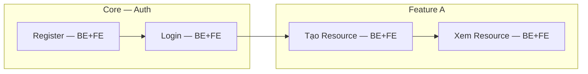

# Feature Index

> **Mục đích**: Tracking toàn bộ tính năng của dự án. File này là trung tâm điều hướng (Index) để biết dự án có bao nhiêu tính năng, và tính năng nào đã được triển khai.

## 1. Feature Priority List

<!-- 
📌 HƯỚNG DẪN ĐIỀN: 
- FR ID: Bắt buộc theo format FR-{DOMAIN}-{NNN} (business feature ID, KHÔNG chứa layer)
  - {DOMAIN} = MỘT token in hoa, KHÔNG hyphen. Compound area → qualifier vào slug: FR-PAYMENT-001--billing (KHÔNG FR-PAYMENT-BILLING-001)
  - Layer (BE | FE | BE+FE) nằm ở cột `Layer` dưới đây và frontmatter của FR file
  - Cùng 1 feature có BE + FE = 1 FR duy nhất với layer=BE+FE, KHÔNG tách thành 2 FR
- Feature: Tên tính năng ngắn gọn
- Service: Tên Microservice (BE) hoặc App/Component (FE)
- Priority: Must (Bắt buộc) / Should (Nên có) / Nice (Nếu rảnh)
- Status: Todo / In Progress / Done
-->

| FR ID | Feature | Service/App | Layer | Priority | Status | Phase Mapping |
|-------|---------|-------------|-------|----------|--------|---------------|
| `{{FR-DOMAIN-NNN}}` | {{feature_name}} | {{service_name}} | BE+FE | Must | 🔲 Todo | Phase {{N}} |
| `{{FR-DOMAIN-NNN}}` | {{feature_name}} | {{service_name}} | BE | Must | 🔲 Todo | Phase {{N}} |
| `{{FR-DOMAIN-NNN}}` | {{feature_name}} | {{app_name}} | FE | Should | 🔲 Todo | Phase {{N}} |

## 2. Feature Dependency Graph

<!--
📌 HƯỚNG DẪN ĐIỀN:
- Cập nhật biểu đồ Mermaid để AI hiểu rõ thứ tự triển khai.
-->

## 3. Implementation Order (Wave / Phase)

| Wave/Phase | Features (FR IDs) | Parallelizable? | Prerequisite |
|------------|-------------------|-----------------|-------------|
| 1 | `FR-AUTH-001` (BE), `FR-AUTH-002` (BE) | Sequential | None |
| 1 | `FR-AUTH-001` (FE), `FR-AUTH-002` (FE) | Sequential | Wave 1 BE done |
| 2 | `{{first_wave_features}}` | Yes | Wave 1 |
| 3 | `{{second_wave_features}}` | Yes | Wave 2 |

## 4. Documentation Links

Link đến chi tiết Feature Specs (Implementation Specs / Test Specs)

| FR ID | Impl Spec | Test Spec | Note |
|-------|-----------|-----------|------|
| `{{FR-DOMAIN-NNN}}` | [Backend Impl]({{link_to_impl_spec}}) / [Frontend Impl]({{link_to_impl_spec}}) | [Backend Test]({{link_to_test_spec}}) / [Frontend Test]({{link_to_test_spec}}) | layer: BE+FE |
| `{{FR-DOMAIN-NNN}}` | [Backend Impl]({{link_to_impl_spec}}) | [Backend Test]({{link_to_test_spec}}) | layer: BE |
