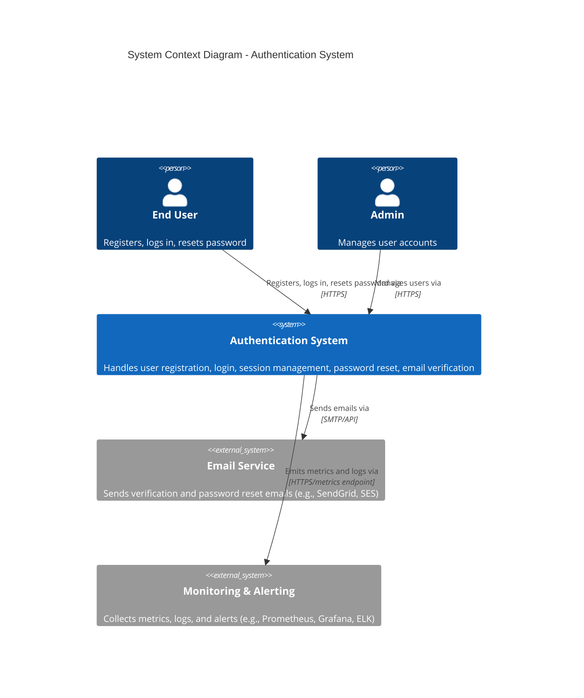
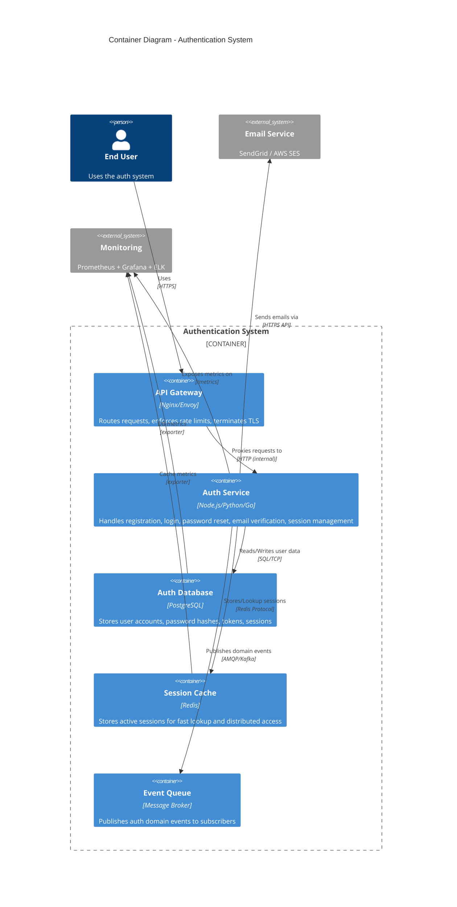

# System Architecture: User Authentication

## C4 Level 1: System Context

## C4 Level 2: Container Diagram

## Communication Patterns

### Synchronous (REST)
- All client-to-auth-service communication is synchronous REST over HTTPS.
- Auth service exposes REST endpoints for: register, login, logout, verify-email, password-reset (request + execute), session-info.

### Asynchronous (Events)
- Auth service publishes domain events (registration, login, password reset, account lock/unlock).
- Downstream services (notification, audit, analytics, user profile) consume events asynchronously.

### Internal Communication
- Auth service communicates with PostgreSQL for user data and token storage.
- Auth service communicates with Redis for session cache (distributed session store for horizontal scaling).
- Auth service communicates with email provider via HTTPS API for sending transactional emails.

## Data Architecture

### Data Stores

| Store | Technology | Purpose | Data |
|-------|-----------|---------|------|
| Primary Database | PostgreSQL | Source of truth | Users, password hashes, tokens, failed login counters |
| Session Cache | Redis | Fast session lookup | Active sessions (token, user_id, metadata, TTL) |
| Event Queue | Message Broker | Async event distribution | Domain events (temporary, TTL-based retention) |

### Data Ownership Matrix

| Entity | Owner Service | Accessed By | Access Method |
|--------|--------------|-------------|---------------|
| User (account) | auth-service | auth-service only | Direct SQL |
| Password Hash | auth-service | auth-service only | Direct SQL |
| Verification Token | auth-service | auth-service only | Direct SQL |
| Reset Token | auth-service | auth-service only | Direct SQL |
| Session | auth-service | auth-service (read/write), API gateway (validate) | Redis |
| Failed Login Counter | auth-service | auth-service only | Direct SQL |
| Domain Events | auth-service | Downstream services | Message queue |

### Data Ownership Rules
1. **Users table**: Owned by auth-service. No other service reads or writes directly.
2. **Sessions**: Owned by auth-service. API gateway may validate sessions via a readonly Redis endpoint or a dedicated session-validation API.
3. **Events**: Published by auth-service. Subscribers never modify.

## Security Architecture

### Authentication Flow
1. Client submits credentials (email + password) to POST /api/v1/auth/login.
2. Auth service validates credentials, creates session in Redis.
3. Session cookie/token returned to client.
4. Subsequent requests include session cookie/token.
5. API gateway or auth service validates session on each request.

### Service-to-Service Authentication
- Internal service communication uses mTLS or a service mesh.
- Other services calling auth-service for session validation use a service API key (stored in secrets manager).

### Encryption
- **In transit**: TLS 1.2+ for all external and internal communication.
- **At rest**: Password hashes (bcrypt/argon2). Tokens stored as HMAC hashes. Database encryption at rest (cloud provider managed keys).

### Key Rotation
- Session signing keys: Rotated every 90 days.
- Password hashing: Algorithm upgrade path documented. Existing hashes re-hashed on next login.

## Infrastructure

### Deployment
- Auth service: Containerized, deployed to Kubernetes or equivalent orchestrator.
- PostgreSQL: Managed service with primary + read replica.
- Redis: Managed service with primary + replica, or Redis Cluster for larger deployments.

### CI/CD
- Automated testing pipeline: Unit, integration, E2E tests run on every PR.
- Deployment pipeline: Canary -> Staging -> Production with automated rollback on error rate threshold.

### Observability
- **Metrics**: Prometheus metrics exposed on /metrics (request count, latency, error rate, auth success/failure rate, active sessions).
- **Logging**: Structured JSON logs with correlation IDs.
- **Tracing**: Distributed tracing with correlation ID propagation.
- **Alerting**: Error rate > 1% (5min window), P95 latency > 500ms, login failure rate spike, DB connection pool exhaustion.

## External Systems

| System | Purpose | Integration Method |
|--------|---------|-------------------|
| Email Provider (SendGrid/AWS SES) | Send verification and password reset emails | HTTPS REST API |
| Monitoring (Prometheus/Grafana) | Metrics collection and visualization | Pull-based /metrics endpoint |
| Log Aggregation (ELK) | Centralized logging | Log shipper (Fluentd/Filebeat) |
| Secrets Manager (Vault/AWS SM) | Store API keys, signing keys, DB credentials | API at startup, auto-refresh |
