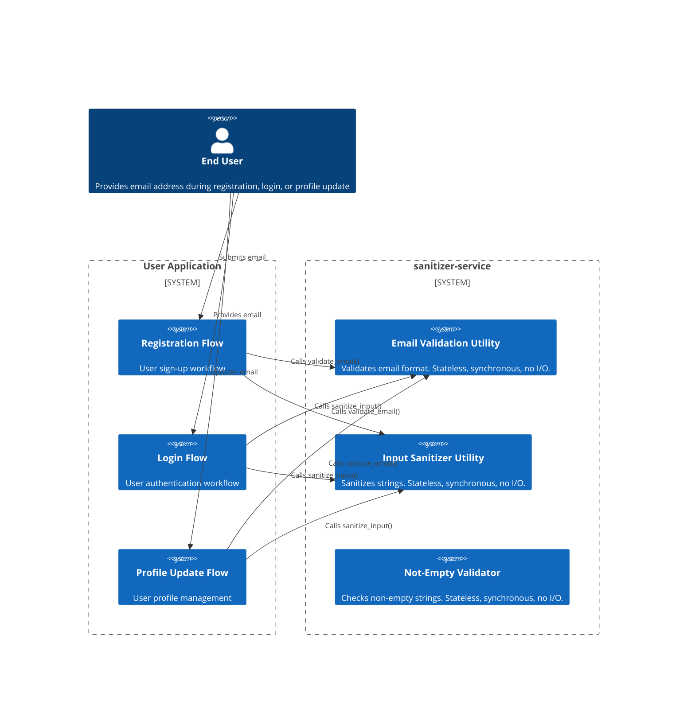
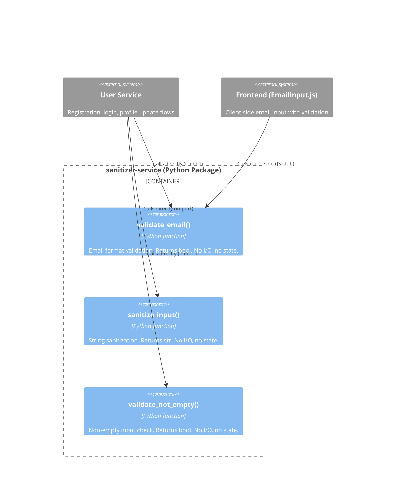
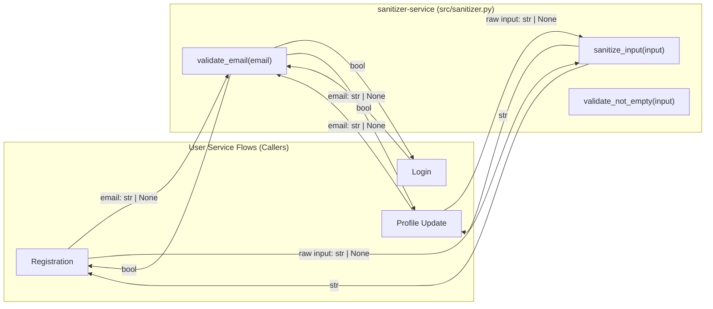

# High-Level Design (HLD) -- Email Validation Utility (sanitizer-service)

## 1. Architecture Style Decision

**Chosen**: In-process utility function within a single-service architecture (Modular Monolith).

**Rationale**: The email validation utility has zero external dependencies, no persistent state, and no I/O operations. Deploying it as a standalone microservice would introduce network latency, serialization overhead, and deployment complexity with no benefit. The utility is invoked synchronously by callers within the same process boundary (user registration, login, profile update flows).

**ADR**: ADR-001-email-validation-as-utility.md

---

## 2. System Context (C4 Level 1)

The `sanitizer-service` is a Python package exposing three stateless utilities: email validation, input sanitization, and non-empty validation. External consumers are user-facing application flows that validate user-provided data before persistence or processing.



### System Context Narrative

- **End User**: A person interacting with the application. Provides an email address.
- **User Application (Registration / Login / Profile)**: Three flows within the larger user-service application that consume the email validator to enforce input format correctness before proceeding with business logic.
- **sanitizer-service**: A Python package exposing `validate_email(email: str | None) -> bool`, `sanitize_input(input_val: str | None) -> str`, and `validate_not_empty(input_val: str | None) -> bool`. All functions are pure -- format-only, no DNS lookups, no SMTP checks, no database queries, synchronous, boolean/string return.

No external systems appear at this level because the utility has zero external dependencies.

### External Interface

| Interface | Type | Input | Output |
|-----------|------|-------|--------|
| `validate_email` | Sync function call (in-process) | `email: str \| None` | `bool` |
| `sanitize_input` | Sync function call (in-process) | `input_val: str \| None` | `str` |
| `validate_not_empty` | Sync function call (in-process) | `input_val: str \| None` | `bool` |

---

## 3. Container Diagram (C4 Level 2)

With only one service and no inter-service communication, the container diagram shows the sanitizer-service as a single deployment unit with three internal utility functions.



### Container Narrative

The entirety of `sanitizer-service` compiles to a single Python module (`src/sanitizer.py`). It is imported as a library by the user service. There is no API gateway, no message broker, no database -- the utility functions are pure, stateless transformations.

- **`validate_email()`**: Implements FR-VAL-001 and FR-VAL-002. Accepts a string or None, returns bool.
- **`sanitize_input()`**: String sanitization pipeline: strip control chars -> trim whitespace -> NFC normalize -> HTML escape -> single-quote escape. Returns str.
- **`validate_not_empty()`**: Checks if input has non-whitespace content. Returns bool.

---

## 4. Data Flow Diagram



---

## 5. Bounded Context Map

```
+------------------------------------------+
| User Service Context                      |
|  Owns: user registration, authentication, |
|         profile management                |
|  Ubiquitous Language: user, credential,   |
|         profile, session                  |
|                                           |
|  +--------------------------------------+ |
|  | Validation Sub-Context               | |
|  |  Owns: email format rules, input     | |
|  |         sanitization rules           | |
|  |  Ubiquitous Language: valid email,   | |
|  |         sanitized string, local part,| |
|  |         domain part                  | |
|  +--------------------------------------+ |
+------------------------------------------+
```

### Boundary Description

The Email Validation Utility operates within a **Validation Sub-Context** inside the User Service. This sub-context is deliberately isolated:

- It owns zero persistent data -- only validation rules (regex pattern, falsy-input guard).
- It has no knowledge of users, accounts, or business logic.
- Communication is strictly inbound: the User Service context calls into the Validation Sub-Context. The Validation Sub-Context never calls out.

### Ubiquitous Language

| Term | Definition | Owning Context |
|------|------------|----------------|
| Email address | `local-part "@" domain-part` | Validation Sub-Context |
| Valid email | String that passes format validation | Validation Sub-Context |
| Null input | Absent value, distinct from empty string | Validation Sub-Context |
| Empty input | String of zero length | Validation Sub-Context |
| Sanitized string | Control chars stripped, trimmed, NFC normalized, HTML escaped | Validation Sub-Context |
| User | Entity with registered email | User Service Context |
| Registration | Workflow creating a new user | User Service Context |

---

## 6. Communication Patterns

| From | To | Pattern | Rationale |
|------|----|---------|-----------|
| User Service (registration) | `validate_email()` | Sync function call (in-process) | Constraint C-001: synchronous operation required |
| User Service (login) | `validate_email()` | Sync function call (in-process) | Same as above |
| User Service (profile update) | `validate_email()` | Sync function call (in-process) | Same as above |
| User Service (registration) | `sanitize_input()` | Sync function call (in-process) | Input sanitization before persistence |
| User Service (profile update) | `sanitize_input()` | Sync function call (in-process) | Input sanitization before persistence |

**No async messaging, no REST/gRPC, no event bus, no message broker.** The utility is a library, not a service.

---

## 7. Service Decomposition

| Service | Responsibility | Data Owned | Ports |
|---------|---------------|------------|-------|
| sanitizer-service | Provides `validate_email()`, `sanitize_input()`, `validate_not_empty()` as pure utility functions with zero side effects and zero I/O | None (stateless) | N/A (library; no network ports) |

**No decomposition into multiple services.** The entire package is a single deployment unit as a Python module.

---

## 8. Security Architecture

### Trust Boundaries

The Email Validation Utility has a single trust boundary: the caller provides untrusted input. The utility defends against:

- **Null/absent input** (FR-VAL-002): Must not crash, must return `false`.
- **Malformed input** (FR-VAL-001): Whitespace-injection attacks, missing `@` bypass attempts. The regex inherently rejects all whitespace.
- **Resource exhaustion** (NFR-SEC-001): No unbounded memory allocation. The regex operates on the input string directly with O(n) complexity.
- **Exception-based bypass** (NFR-SEC-002): Every code path returns a boolean; no path raises an exception.
- **ReDoS attacks**: The regex `^[^\s@]+@[^\s@]+\.[^\s@]+$` has no nested quantifiers and no backtracking amplifiers -- ReDoS-safe by construction.
- **XSS via HTML**: `sanitize_input()` escapes `<`, `>`, `&`, `"`, `'` to their HTML entity equivalents.

### Data Protection

The utility processes PII (email strings) but does not persist or transmit them:
- **At rest**: N/A (stateless, no database).
- **In transit**: N/A (in-process function call; no network).

### Authentication / Authorization

Not applicable. The utility is called by code within the same trust domain. Callers are responsible for access control.

---

## 9. Infrastructure Architecture

| Aspect | Detail |
|--------|--------|
| Deployment unit | Single Python package (`sanitizer-service`) |
| Runtime | Python 3.x (compatible with caller's environment) |
| Packaging | `src/sanitizer.py` as importable module |
| External dependencies | **None** -- Python stdlib only (re, html, unicodedata) |
| Scaling | Horizontally via caller's scaling (stateless, infinite replicas) |
| Observability | N/A (function-level; caller instruments invocation timing) |
| CI/CD | Standard Python test suite (`pytest`) on every commit |

No container orchestration, no cloud services, no databases.

---

## 10. Architecture Decision Records (ADRs)

### ADR-001: Email Validation as Utility Function (Not Microservice)

**Status**: Accepted
**Decision**: Implement email validation as an in-process utility function (`validate_email`) within the `sanitizer-service` Python package. NOT deployed as a standalone microservice.
**Rationale**:
- Performance: P95 latency <1ms (NFR-PERF-001) would be impossible with network round-trip.
- Simplicity: Zero dependencies, zero state, zero I/O -- microservice adds no value.
- Synchronous constraint (C-001): In-process function call is fastest sync invocation.
- Stateless constraint (C-002): Standalone process adds no isolation benefit.
- Reusability (NFR-MNT-001): Callable from any Python code with zero configuration.
**Alternatives considered**: Microservice (REST/gRPC) -- rejected for latency, complexity, over-engineering. Serverless function -- rejected for cold-start latency, still requires network hop.

### ADR-002: Regex-Based Validation (Not Library-Based)

**Status**: Accepted
**Decision**: Use a single compiled regular expression (`^[^\s@]+@[^\s@]+\.[^\s@]+$`) with an early null/empty guard. No third-party validation library.
**Rationale**:
- Zero external dependencies (meets C-003: no I/O).
- Predictable O(n) performance (<1ms, meets NFR-PERF-001).
- Deterministic output (meets NFR-REL-002).
- Simple to audit for security (meets NFR-SEC-002).
- SRS deliberately scopes to basic format check -- not full RFC 5322 compliance.
**ReDoS safety**: The regex has no nested quantifiers, no backtracking amplifiers -- safe by construction.
**Alternatives considered**: Library-based (`email-validator`) -- rejected for external dependency, DNS lookup risk, supply-chain concern. Manual parsing -- rejected for code complexity, maintenance burden.

### ADR-003: API Conventions for Utility Function Interface

**Status**: Accepted
**Decision**: `validate_email(email: str | None) -> bool` with no exceptions, boolean-only results, thread-safe by construction, package-level versioning.
**Rationale**:
- SRS Section 4.2: "No exceptions; all outcomes expressed via boolean return value."
- Simplicity for callers: `if validate_email(email):` pattern, no try/except.
- Type safety: `str | None` input with static analysis compatibility.
- Thread safety by construction: pure function, immutable args, no shared state.
**Alternatives considered**: Result object -- rejected as over-engineered for boolean check. Exception-raising -- rejected, violates NFR-REL-001 and SRS 4.2.

### ADR-004: Event-Free Architecture (Event Taxonomy)

**Status**: Accepted
**Decision**: The sanitizer-service produces and consumes zero events. All communication is synchronous, in-process function calls.
**Rationale**:
- Synchronous constraint (C-001): Events are inherently asynchronous, violating the constraint.
- Stateless constraint (C-002): Events imply retained knowledge about what happened.
- No I/O constraint (C-003): Publishing/subscribing to events requires I/O (message broker).
- Pure computation: The utility returns immediate results; no meaningful domain event to publish.
- Caller already knows the result of the call; event publication would be redundant.
**Alternatives considered**: Event-driven validation (domain events for validation outcomes) -- rejected as violation of constraints C-001/002/003 and unnecessary for a pure computation.
**Future extensibility**: If async validation (deferred deliverability checks) is needed, an ADR amendment would introduce event taxonomy with a message broker. Placeholder events defined in `agent_docs/contracts/events.md`.
**Event registry**: EMPTY. No events defined for this project.

---

## 11. Hard Boundaries (27 Rules)

See `agent_docs/hard-boundaries.md` for the full boundary specification. Key rules:

1. **No I/O** in `validate_email` or `sanitize_input` -- no database, filesystem, network, DNS (C-003).
2. **No mutable state** -- functions must remain pure across invocations (C-002).
3. **No signature changes** without amending ADR-003.
4. **No external dependencies** to validation logic (ADR-002).
5. **No exceptions** -- every input path must return a boolean (NFR-REL-001).
6. **No data ownership** -- zero tables, files, caches.
7. **No data persistence** -- do not log, store, or transmit the email string.
8. **ReDoS-safe regex** required -- no nested quantifiers.
9. **Test coverage** must match every FR scenario (NFR-MNT-002).

---

## 12. Domain-Service Mapping

| FR ID | Service | Function | Description |
|-------|---------|----------|-------------|
| FR-VAL-001 | sanitizer-service | validate_email | Email format validation |
| FR-VAL-002 | sanitizer-service | validate_email | Null and empty input handling |

The sanitizer-service domain is `validation`. It owns `email_validation_rules` and `input_sanitization_rules`. It owns zero data.

---

## 13. Diagrams (External Sources)

Mermaid diagram source files:
- `projects/sanitizer-service/docs/architecture/diagrams/system-context.mermaid` -- C4 Level 1
- `projects/sanitizer-service/docs/architecture/diagrams/container-diagram.mermaid` -- C4 Level 2
- `projects/sanitizer-service/docs/architecture/diagrams/data-flow.mermaid` -- Data flow

---

## 14. References

- SRS: `projects/sanitizer-service/docs/product/SRS.md`
- ADR-001: `projects/sanitizer-service/docs/architecture/ADRs/ADR-001-email-validation-as-utility.md`
- ADR-002: `projects/sanitizer-service/docs/architecture/ADRs/ADR-002-regex-vs-library-validation.md`
- ADR-003: `projects/sanitizer-service/docs/architecture/ADRs/ADR-003-api-conventions.md`
- Hard Boundaries: `projects/sanitizer-service/agent_docs/hard-boundaries.md`
- API Conventions: `projects/sanitizer-service/agent_docs/contracts/api-conventions.md`
- Events: `projects/sanitizer-service/agent_docs/contracts/events.md`
- Domain Mapping: `projects/sanitizer-service/agent_docs/domain-service-mapping.yaml`
- Traceability Matrix: `projects/sanitizer-service/agent_docs/traceability/requirements-matrix.md`
