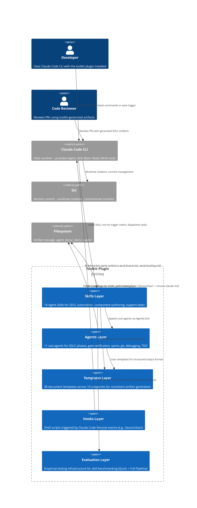
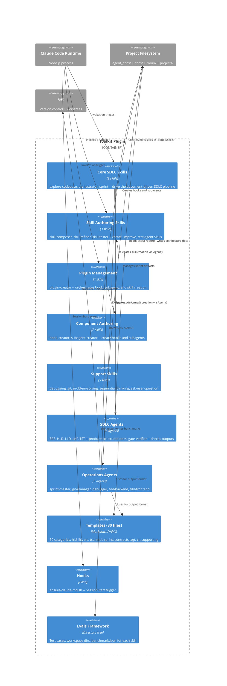

# System Architecture: toolkit

## 1. Architecture Style Decision

**Chosen**: Plugin-Based Modular Architecture with Skill-Driven Orchestration

**Rationale**: The toolkit is a Claude Code plugin -- not a standalone application. Its architecture is constrained by the Claude Code plugin framework: skills in `.claude/skills/`, agents in `.claude/agents/`, hooks in `.claude/hooks/`, templates in `.claude/templates/`. The plugin boundary is the Claude Code runtime, which provides the execution environment (Agent, Skill, Bash, Read, Write tools). Skills orchestrate agents; agents produce structured documents using templates. There is no HTTP server, no database, no message broker -- all state is in files on disk. This architecture was chosen because the plugin framework mandates it; no alternative architectural style (monolith, microservices) is viable for a Claude Code plugin.

**ADR**: ADR-001-service-decomposition.md

## 2. System Context (C4 Level 1)



### System Context Narrative

- **Developer**: Human using Claude Code CLI with the toolkit plugin installed. Invokes skills via slash commands (e.g., `/explore-codebase`, `/skill-composer`, `/sprint`) or skills auto-activate based on description trigger phrases.
- **Code Reviewer**: Reviews pull requests that include toolkit-generated SDLC documentation (SRS, HLD, LLD, IMP, TST, sprint artifacts).
- **Claude Code CLI**: Host runtime. Loads plugin's skills, agents, hooks, templates. Provides execution sandbox (Read, Write, Bash, Agent, Skill tools).
- **Skills Layer**: 14 Agent Skills. Each is a SKILL.md with frontmatter (name, description, invocation controls) + body (procedural instructions). Skills auto-activate on trigger phrases or via `/` commands.
- **Agents Layer**: 11 sub-agents for SDLC phases (SRS, HLD, LLD, IMP, TST), gate verification, sprint management, git operations, debugging, and TDD workflows.
- **Templates Layer**: 30 document templates across 10 categories ensuring consistent artifact structure throughout the SDLC pipeline.
- **Hooks Layer**: Shell scripts registered via `hooks.json` and `settings.json`. Example: `ensure-claude-md.sh` on SessionStart loads CLAUDE.md into context.
- **Evaluation Layer**: `evals/` directory for empirical skill testing with Quick Workflow (pass/fail) and Full Pipeline (baseline comparison, token/timing metrics) modes.
- **Git**: Version control used for worktree isolation (`/using-git-worktrees`) and conventional commits (`/git`).
- **Filesystem**: All state is file-based. `agent_docs/` for agent-oriented docs, `docs/` for user-facing docs, `.work/` for runtime artifacts, `projects/` for reference implementations.

## 3. Container Diagram (C4 Level 2)



### Container Narrative

**Core SDLC Skills** (3): `explore-codebase` drives the end-to-end pipeline (Scout -> Explore -> Plan -> SDLC Pipeline -> Sprint -> Summary). `orchestrator` handles multi-agent workflow orchestration. `sprint` manages roadmap, backlog, and board artifacts.

**Skill Authoring Skills** (3): `skill-composer` creates new skills from scratch with best practices. `skill-refiner` improves existing skills for clarity, efficiency, and production readiness. `skill-tester` empirically tests and benchmarks skills with two evaluation modes.

**Plugin Management** (1): `plugin-creator` creates, validates, and publishes Claude Code plugins. Orchestrates component creation by delegating to skill-composer, subagent-creator, and hook-creator.

**Component Authoring** (2): `hook-creator` creates/validates hooks for workflow automation. `subagent-creator` creates/validates subagents with tool scoping and permission modes.

**Support Skills** (5): Cross-cutting utilities consumed by all other skills. `debugging` for systematic debugging, `git` for conventional commits, `problem-solving` for creative problem-solving, `sequential-thinking` for step-by-step analysis, `ask-user-question` for interactive user input.

**SDLC Agents** (6): Specialized agents for each SDLC phase. SRS extracts requirements, HLD designs architecture, LLD produces per-service design, IMP writes implementation specs, TST writes test specs, gate-verifier checks outputs against criteria.

**Operations Agents** (5): sprint-master manages sprint artifacts, git-manager handles version control, debugger for debugging workflows, tdd-backend and tdd-frontend for test-driven development.

**Templates** (30 files): Default output formats in 10 categories. Agents use these unless the spawning skill overrides.

**Hooks**: One hook currently: `ensure-claude-md.sh` on SessionStart ensures CLAUDE.md is loaded.

**Evals Framework**: Directory structure for empirical testing. Each skill has its own eval space with test scenarios and benchmark outputs.

## 4. Bounded Context Map

```
+-------------------------------------------------------------+
| Skill Authoring Context                                      |
|  Owns: SKILL.md format, frontmatter spec, trigger phrases,   |
|         progressive disclosure patterns, template conventions |
|  Skills: skill-composer, skill-refiner, skill-tester         |
|  Ubiquitous Language: SKILL.md, frontmatter, body, trigger,  |
|         description, invoke, progressive disclosure, token   |
+-------------------------------------------------------------+

+-------------------------------------------------------------+
| Plugin Management Context                                    |
|  Owns: plugin.json manifest, directory layout, marketplace   |
|         publishing, installation scoping                      |
|  Skill: plugin-creator                                       |
|  Ubiquitous Language: plugin, manifest, marketplace, scope,  |
|         install, publish, component                          |
+-------------------------------------------------------------+

+-------------------------------------------------------------+
| Component Authoring Context                                  |
|  Owns: hook scripts, event matchers, decision schemas,       |
|         subagent tool scoping, permission modes               |
|  Skills: hook-creator, subagent-creator                      |
|  Ubiquitous Language: hook, event matcher, decision schema,  |
|         command hook, prompt hook, subagent, tool scope,     |
|         permission mode, acceptEdits                          |
+-------------------------------------------------------------+

+-------------------------------------------------------------+
| SDLC Pipeline Context                                        |
|  Owns: SRS->HLD->LLD->IMP+TST pipeline, gate verification,   |
|         sprint board/backlog/roadmap, agent brief protocol    |
|  Skills: explore-codebase, orchestrator, sprint              |
|  Agents: srs, hld, lld, imp, tst, gate-verifier, sprint-master|
|  Ubiquitous Language: scout, phase, gate, re-spawn, pipeline,|
|         sprint, backlog, roadmap, board, brief, task          |
+-------------------------------------------------------------+

+-------------------------------------------------------------+
| Support Context                                              |
|  Owns: debugging heuristics, git conventions, problem-solving|
|         frameworks, sequential analysis patterns              |
|  Skills: debugging, git, problem-solving, sequential-thinking,|
|           ask-user-question                                   |
|  Ubiquitous Language: root cause, conventional commit,       |
|         worktree, stuck point, collision zone, step           |
+-------------------------------------------------------------+
```

## 5. Communication Patterns

| From | To | Pattern | Mechanism |
|------|----|---------|-----------|
| Claude Code Runtime | Skill | Load on trigger | Plugin framework convention |
| Skill | Sub-Agent | Process spawn | Agent() tool invocation |
| Skill | Other Skill | Cross-skill call | Skill() tool invocation |
| Sub-Agent | Templates | File read | Read tool |
| Sub-Agent | Filesystem | File write | Write/Edit tool |
| Hook | Claude Code Runtime | Shell command | Lifecycle event binding |
| Skill | Sprint Artifacts | Indirect (via sprint skill) | Skill(sprint) invocation |
| Skill | Eval Infrastructure | File write | skill-tester writes benchmarks |

No network communication. No message broker. No HTTP. No database transactions. All interaction is in-process or file-based.

## 6. Service Decomposition

| Service | Domain | Responsibility | Data Owned |
|---------|--------|---------------|------------|
| explore-codebase | SDLC Pipeline | End-to-end SDLC doc generation, pipeline orchestration | Agent briefs, pipeline rules |
| orchestrator | SDLC Pipeline | Multi-agent workflow orchestration | Orchestration config |
| sprint | SDLC Pipeline | Roadmap/backlog/board artifact management | Sprint state (.work/) |
| skill-composer | Skill Authoring | Create new Agent Skills from scratch | Skill creation patterns |
| skill-refiner | Skill Authoring | Improve existing skills for quality | Quality standards, checklists |
| skill-tester | Skill Authoring | Empirically test and benchmark skills | Test cases, benchmarks |
| plugin-creator | Plugin Management | Create/validate/publish plugins | Plugin structure, manifest rules |
| hook-creator | Component Authoring | Create/validate hooks | Event matchers, decision schemas |
| subagent-creator | Component Authoring | Create/validate subagents | Tool scoping, permission modes |
| debugging | Support | Systematic debugging with root cause analysis | Debugging heuristics |
| git | Support | Git operations with conventional commits | Commit conventions |
| problem-solving | Support | Creative problem-solving techniques | Problem-solving frameworks |
| sequential-thinking | Support | Step-by-step analysis for complex problems | Analysis patterns |
| ask-user-question | Support | Interactive user input and decisions | Question patterns |

## 7. Security Architecture

### Trust Boundaries

- **No network exposure**: Skills and agents do not expose HTTP endpoints. All operations are local filesystem access within the project directory.
- **File system isolation**: Git worktrees provide isolation between concurrent feature work sessions.
- **Template injection prevention**: Templates use placeholders replaced by agents, not user input. No code execution risk.
- **Hook sandboxing**: Hooks are shell scripts with timeout enforcement (timeout: 3000ms). `onError: warn` prevents crash on hook failure.
- **Plugin scope**: Plugin installed with `--scope project` limits its effects to the current project directory.

### Data Protection

- **At rest**: All artifacts are markdown/yaml files. Git provides version history and recovery.
- **In transit**: N/A -- no network communication in the toolkit itself (Claude Code handles API communication with Anthropic).
- **Secrets**: Toolkit processes no credentials, tokens, or PII. CLAUDE.md explicitly prohibits committing sensitive files.

## 8. Infrastructure Architecture

| Aspect | Detail |
|--------|--------|
| Deployment unit | Claude Code plugin (directory tree: skills/, agents/, hooks/, templates/) |
| Runtime | Claude Code CLI (Node.js process) |
| Installation | `claude plugin install . --scope project` |
| Configuration | `.claude/settings.json` + `.claude/settings.local.json` |
| State persistence | File-based: `.work/`, `agent_docs/`, `docs/`, `evals/`, `projects/` |
| Observability | skill-tester benchmarks (token usage, timing deltas); session logs |
| Versioning | Semantic versioning: plugin version in manifest, skill versions independent |

No containers, cloud services, databases, or orchestration platforms. The toolkit is a collection of markdown/yaml/shell files.

## 9. Architecture Decision Records

| ADR | Decision | Status |
|-----|---------|--------|
| ADR-001 | Service Decomposition: Skill-per-domain with agent-based delegation | Accepted |
| ADR-002 | API Conventions: Skill frontmatter + Agent briefs as inter-component contract | Accepted |
| ADR-003 | Event Taxonomy: Claude Code lifecycle events + skill trigger matching + pipeline phases | Accepted |

## 10. Reference Sub-Project

The toolkit includes a reference implementation at `projects/sanitizer-service/` demonstrating the full SDLC pipeline output. It is a Python utility package with:
- `validate_email()` -- email format validation (regex-based, no DNS/SMTP)
- `sanitize_input()` -- input sanitization (control chars, Unicode, HTML escape)
- `validate_not_empty()` -- whitespace-only input guard
- Architecture: Utility function pattern (in-process, zero I/O, stateless)
- Testing: pytest suite with coverage for all FR scenarios

This sub-project is architecturally independent from the toolkit and serves only as a reference for the SDLC pipeline's document generation capabilities.
