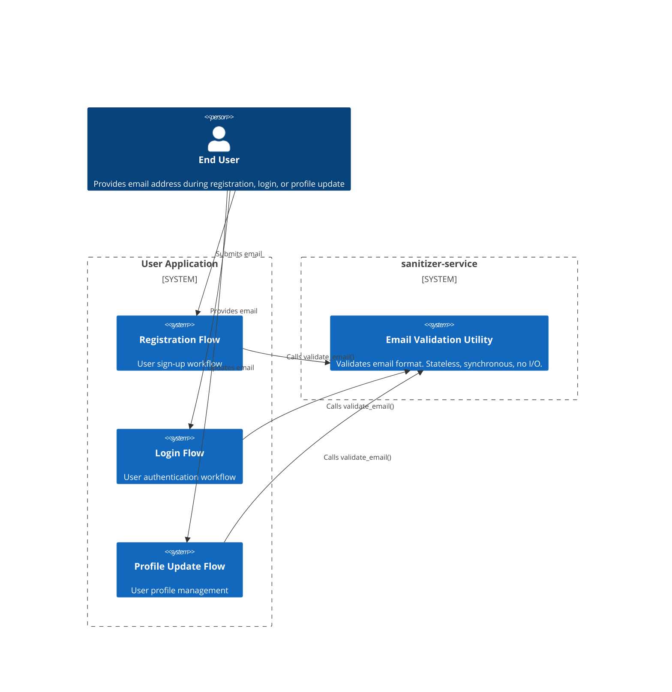
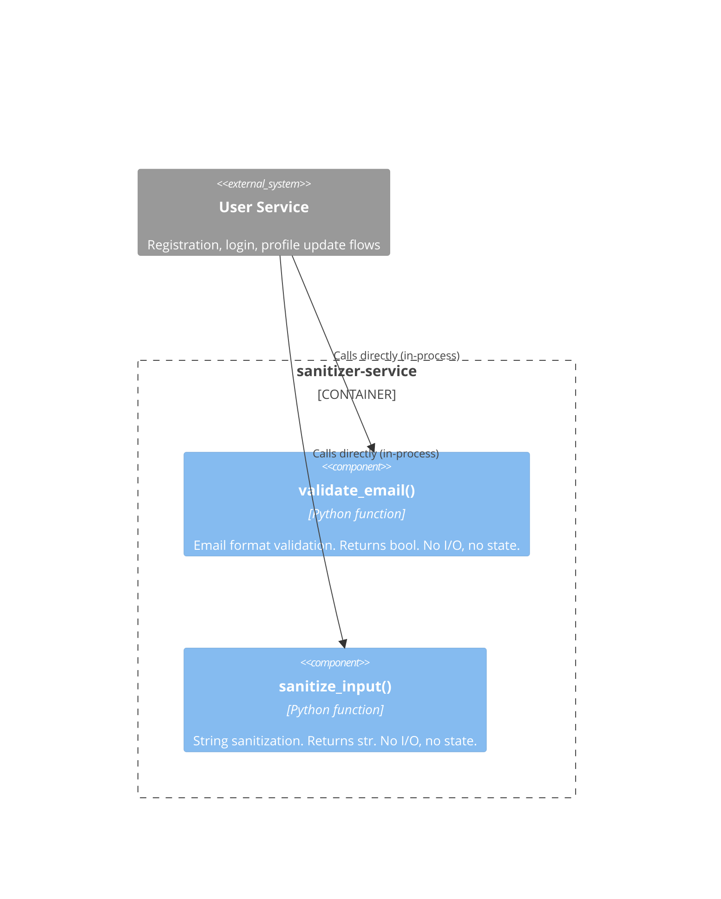

# High-Level Design (HLD) -- Email Validation Utility (sanitizer-service)

## 1. Architecture Style Decision

**Chosen**: In-process utility function within a single-service architecture (Modular Monolith).

**Rationale**: The email validation utility has zero external dependencies (SRS Section 4.3), no persistent state (C-002), and no I/O operations (C-003). Deploying it as a standalone microservice would introduce network latency, serialization overhead, and deployment complexity with no benefit. The utility is invoked synchronously (C-001) by callers within the same process boundary (user registration, login, profile update flows per SRS Section 1.1).

**ADR**: ADR-001-email-validation-as-utility.md

## 2. System Context (C4 Level 1)

The `sanitizer-service` is a Python package exposing two stateless utilities: email validation and input sanitization. External consumers are user-facing application flows that validate user-provided data before persistence or processing.



### System Context Narrative

- **End User**: A person interacting with the application. Provides an email address.
- **User Application (Registration / Login / Profile)**: Three flows within the larger user-service application that consume the email validator to enforce input format correctness before proceeding with business logic (e.g., persisting a user record, authenticating, or updating profile data).
- **sanitizer-service / Email Validation Utility**: A Python package exposing `validate_email(email: str | None) -> bool`. It performs format-only validation -- no DNS lookups, no SMTP checks, no database queries. It operates synchronously and returns a boolean.

No external systems appear at this level because the validator has zero external dependencies (SRS Section 4.3).

### External Interface

| Interface | Type | Input | Output |
|-----------|------|-------|--------|
| `validate_email` | Synchronous function call (in-process) | `email: str \| None` | `bool` |

## 3. Container Diagram (C4 Level 2)

With only one service and no inter-service communication, the container diagram shows the sanitizer-service as a single deployment unit with two internal utilities.



### Container Narrative

The entirety of `sanitizer-service` compiles to a single Python module (`src/sanitizer.py`). It is imported as a library by the user service. There is no API gateway, no message broker, no database -- the utility functions are pure, stateless transformations.

- **`validate_email()`**: Implements FR-VAL-001 and FR-VAL-002. Accepts a string or `None`, returns `bool`.
- **`sanitize_input()`**: Input sanitization utility (out of scope for T-001 but part of the same package).

## 4. Bounded Context Map

```
+------------------------------------------+
| User Service Context                      |
|  Owns: user registration, authentication, |
|         profile management                |
|  Ubiquitous Language: user, credential,   |
|         profile, session                  |
|                                           |
|  +--------------------------------------+ |
|  | Validation Sub-Context               | |
|  |  Owns: email format rules, input     | |
|  |         sanitization rules           | |
|  |  Ubiquitous Language: valid email,   | |
|  |         sanitized string, local part,| |
|  |         domain part                  | |
|  +--------------------------------------+ |
+------------------------------------------+
```

### Boundary Description

The Email Validation Utility operates within a **Validation Sub-Context** inside the User Service. This sub-context is deliberately isolated from the rest of the user service:

- It owns zero persistent data -- only the validation rules (the regex pattern and the falsy-input guard).
- It has no knowledge of users, accounts, or business logic.
- Communication is strictly inbound: the User Service context calls into the Validation Sub-Context. The Validation Sub-Context never calls out.

### Ubiquitous Language

| Term | Definition | Owning Context |
|------|------------|----------------|
| Email address | `local-part "@" domain-part` | Validation Sub-Context |
| Valid email | A string that passes format validation | Validation Sub-Context |
| Null input | Absent value, distinct from empty string | Validation Sub-Context |
| Empty input | String of zero length | Validation Sub-Context |
| User | An entity in the user service with a registered email | User Service Context |
| Registration | The workflow that creates a new user | User Service Context |

## 5. Communication Patterns

| From | To | Pattern | Rationale |
|------|----|---------|-----------|
| User Service (registration) | `validate_email()` | Synchronous function call (in-process) | Constraint C-001 requires synchronous operation; no network boundary exists |
| User Service (login) | `validate_email()` | Synchronous function call (in-process) | Same as above |
| User Service (profile update) | `validate_email()` | Synchronous function call (in-process) | Same as above |

No async messaging, no REST/gRPC, no event bus. The validator is a library, not a service.

## 6. Service Decomposition

| Service | Responsibility | Data Owned | Ports |
|---------|---------------|------------|-------|
| sanitizer-service | Provides `validate_email()` and `sanitize_input()` as pure utility functions with zero side effects and zero I/O | None (stateless) | N/A (library; no network ports) |

No decomposition into multiple services. The entire package is a single deployment unit.

## 7. Security Architecture

### Trust Boundaries

The Email Validation Utility has a single trust boundary: the caller provides untrusted input. The utility must defend against:

- **Null/absent input** (FR-VAL-002): Must not crash, must return `false`.
- **Malformed input** (FR-VAL-001): Whitespace-injection attacks (e.g., `user @domain.com`), missing `@` bypass attempts. The regex inherently rejects all whitespace.
- **Resource exhaustion** (NFR-SEC-001): No unbounded memory allocation. The regex operates on the input string directly with no copy growth.
- **Exception-based bypass** (NFR-SEC-002): Every code path returns a boolean; no path raises an exception.

### Data Protection

The utility processes no PII beyond the email string itself, and does not persist or transmit it:

- **At rest**: N/A (stateless, no database).
- **In transit**: N/A (in-process function call; no network).

### Authentication / Authorization

Not applicable. The utility is called by code within the same trust domain. Callers are responsible for access control (e.g., ensuring the user is authenticated before the profile update flow invokes validation).

## 8. Infrastructure Architecture

| Aspect | Detail |
|--------|--------|
| Deployment unit | Single Python package (`sanitizer-service`) |
| Runtime | Python 3.x (compatible with caller's environment) |
| Packaging | `src/sanitizer.py` as importable module |
| Scaling | Horizontally via caller's scaling (stateless, so infinite replicas work without coordination) |
| Observability | N/A (function-level; caller instruments invocation timing) |
| CI/CD | Standard Python test suite (`pytest`) runs on every commit |

No container orchestration, no cloud services, no databases. The utility is deployed as a dependency of the user service.

## 9. Architecture Decision Records

| ADR | Decision | Status |
|-----|---------|--------|
| ADR-001 | Email validation as utility function (not microservice) | Accepted |
| ADR-002 | Regex-based validation (not library-based) | Accepted |
| ADR-003 | API conventions for utility function interface | Accepted |

## 10. Hard Boundaries

See `agent_docs/hard-boundaries.md` for the full boundary specification. Key rules for this project:

1. `validate_email()` must remain pure: no I/O, no state, no side effects.
2. Callers must not modify the validation logic; behavioral changes require an ADR amendment.
3. The utility must never depend on a database, network, or filesystem.
4. Test coverage must match every FR scenario before implementation changes are accepted.

## 11. Diagrams

Mermaid diagram sources are stored separately:

- `docs/architecture/diagrams/system-context.mermaid` -- C4 Level 1
- `docs/architecture/diagrams/container-diagram.mermaid` -- C4 Level 2
- `docs/architecture/diagrams/data-flow.mermaid` -- Data flow between service boundaries
